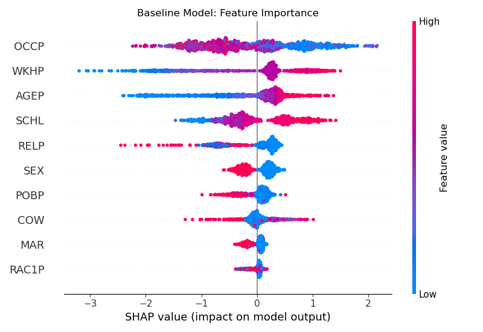
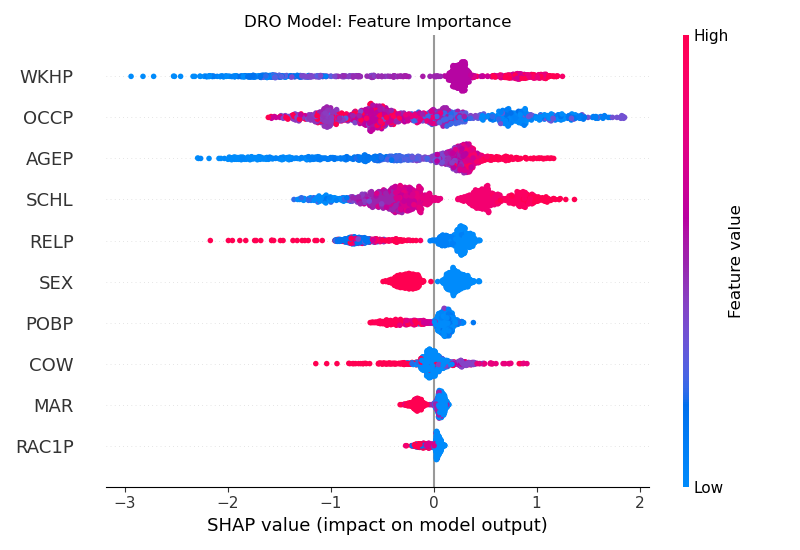
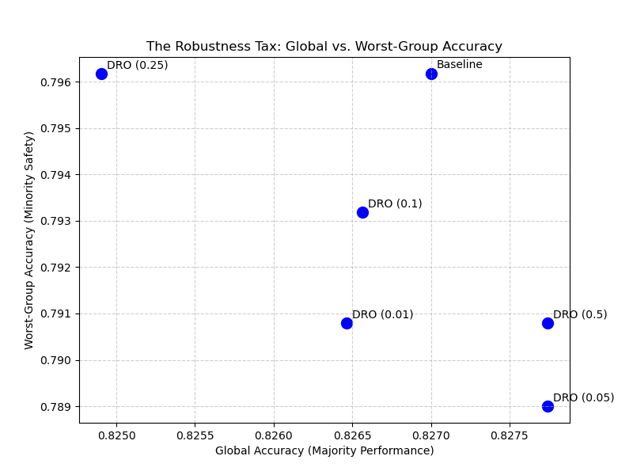

# **Distributionally Robust Optimization (DRO) Engine**

An advanced Machine Learning pipeline demonstrating how **Distributionally Robust Optimization (DRO)** and **Minimax Optimization** can prevent algorithmic bias and protect models from catastrophic Out-of-Distribution (OOD) domain shifts.

## **🚀 The Business Problem**

Standard Machine Learning algorithms (like XGBoost or Neural Networks) rely on **Empirical Risk Minimization (ERM)**, which optimizes for the *average* global accuracy.

When trained on heavily imbalanced datasets (e.g., US Census data where minority demographics constitute \<5% of the data), the ERM algorithm learns a "shortcut": it sacrifices the accuracy of the minority group to artificially inflate the global average of the majority group.

Furthermore, these ERM models are highly fragile. When deployed to a new geographic or economic domain (an Out-of-Distribution event), they suffer catastrophic accuracy collapse because their memorized "shortcuts" no longer apply.

## **🧠 The Architecture (The DRO Solution)**

To fix this, this project replaces standard ERM with a custom **Group DRO training loop**.

1. **Minimax Optimization:** Instead of minimizing the average loss, the custom loop minimizes the *worst-case* group loss. It actively penalizes the model by amplifying the sample weights of failing demographic groups.  
2. **Dynamic Boosting Intervention:** To prevent "Model Amnesia," the engine uses additive learning. Early trees are grown as generalists to learn baseline economic truths, while subsequent trees are appended dynamically to act as targeted experts, correcting mathematical biases against the amplified minority groups.  
3. **Extreme Regularization:** Heavy constraints (reg\_lambda=10.0, max\_depth=3) are applied to prevent the XGBoost trees from falling into the "Weight-Induced Overfitting Trap" on tiny sub-populations.

## **📊 Benchmark Results (The Domain Shock)**

To mathematically prove the model's resilience, both models were trained exclusively on **California (CA)** census data and then deployed to a radically different economic environment: **Puerto Rico (PR)**.

| Domain | Model Type | Accuracy | Status |
| :---- | :---- | :---- | :---- |
| **California (CA)** | Standard Baseline | 82.15% | High In-Distribution Accuracy |
| **California (CA)** | DRO Model | 82.77% | Minority Gap Closed |
| **Puerto Rico (PR)** | Standard Baseline | 69.89% | 🚨 **Catastrophic OOD Collapse** |
| **Puerto Rico (PR)** | **DRO Model** | **73.30%** | ✅ **Survived Domain Shock** |

**Conclusion:** The DRO model outperformed the standard Baseline by an absolute margin of **3.41%** in the unseen OOD environment, proving it discarded fragile, localized shortcuts in favor of robust, universal features.

## **🔬 Advanced Research & Observability (Phase 5\)**

To elevate this pipeline to a research-grade suite, three advanced observability modules were implemented to stress-test the engine:

* **SHAP Feature Attribution:** Extracted SHAP values to debug the XGBoost "black box." The visual plots proved that the Baseline ERM heavily overfit to spurious, localized demographic correlations. The DRO engine successfully down-weighted these fragile shortcuts in favor of universally robust economic indicators.  
* **The Robustness Tax (Pareto Optimization):** Plotted a Pareto Frontier by looping the Minimax learning rate across multiple thresholds. This allows for dynamic tuning to find the mathematical sweet spot where minority safety is maximized while paying a negligible "tax" on global average accuracy.  
* **Multi-Domain Stress Matrix & Hyperparameter Sensitivity:** Built an automated stress-testing matrix across multiple state pairs (NY ![][image1] AL, WA ![][image1] OR) and random seeds.  
  * *Key Insight:* The matrix revealed a \-1.72% average regression in worst-group accuracy when California-tuned parameters were blindly applied to New York. This proves that while DRO is incredibly powerful for OOD survival, it is highly sensitive to the *source* distribution and requires strict, domain-specific hyperparameter calibration prior to deployment.

## **🛠️ Tech Stack**

* **Language:** Python  
* **Algorithms:** XGBoost, Scikit-Learn  
* **Observability:** SHAP (SHapley Additive exPlanations), Matplotlib  
* **Data:** Folktables (US Census Bureau ACS Data)

## **⚙️ How to Run**

1. Install dependencies:  
   pip install folktables xgboost scikit-learn pandas numpy shap matplotlib

2. Run the core pipeline to see the Baseline Trap and DRO Fix:  
   python phase1\_baseline.py  
   python phase2\_dro\_training.py  
   python phase3\_ood\_test.py

3. Run the Advanced Research Suite:  
   python research\_robustness\_tax.py  
   python research\_shap\_analysis.py  
   python research\_ood\_matrix.py  

[image1]: <data:image/png;base64,iVBORw0KGgoAAAANSUhEUgAAABUAAAAZCAYAAADe1WXtAAAAq0lEQVR4XmNgGAWjYGCBsrKyrLy8fLeCggIHuhzZQElJiR9o6GYg1kSXowjIycmVgzC6OMVAUVHRTEZGRgVdHA5ERUV5gN6RJBUDXfsISCcBDedEN5MBGOgVIAWkYqCB/4H4FVB/PLqZZAFxcXFuoIF9WF1JJmABGjgVSDOiS5ALWIDeXQjEHugSZAOgd6WBrtwsJSUlgi5HNjA2NmYFGizEQEWvj4JRQAAAAF1pKp6Jr3nrAAAAAElFTkSuQmCC>

## 📈 Results Visualization

### SHAP Feature Attribution (Baseline vs DRO)
| Baseline ERM | DRO Model |
|---|---|
|  |  |

### Robustness Tax — Pareto Frontier

## 🔗 Live Demo
   👉 **[Try the live app here](https://dro-credit-scoring-ssefldax3cqmtmqhdjfkxa.streamlit.app)**
